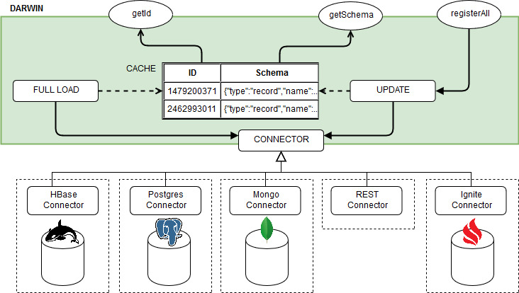
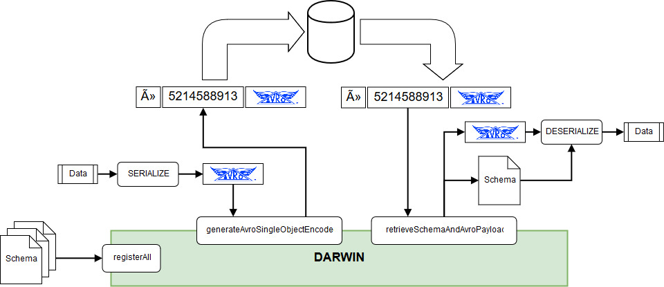

# Darwin

Table of contents
-------------

- General
  - [Overview](#overview)
  - [Artifacts](#artifacts)
  - [Background](#background)
  - [Architecture](#architecture)
- [Installation](#installation)
- [Usage](#usage)
- Configuration
  - [HBase](#hbase)
  - [PostgreSql](#postgresql)
---

Overview
-------------
Darwin is a repository of Avro schemas that maintains all the schema versions used during your application lifetime.
Its main goal is to provide an easy and transparent access to the Avro data in your storage independently from 
schemas evolutions.
Darwin is portable and it doesn't require any application server.
To store its data, you can choose from multiple storage managers (HBase, Postgres) easily pluggable importing the 
desired connector.

Artifacts
--------------
Darwin artifacts are published for scala 2.10, 2.11 and 2.12 on Bintray. To access them add the Bintray Darwin repository to your project's one:

#### sbt

```scala
resolvers += Resolver.bintrayRepo("agile-lab-dev", "WASP")
```

#### maven

```xml
<repositories>
  <repository>
    <snapshots>
      <enabled>false</enabled>
    </snapshots>
    <id>bintray-agile-lab-dev-Darwin</id>
    <name>bintray</name>
    <url>https://dl.bintray.com/agile-lab-dev/Darwin</url>
  </repository>
</repositories>
```

In order to access to Darwin core functionalities add the core dependency to you project:

### core

#### sbt
```scala
libraryDependencies += "it.agilelab" %% "darwin-core" % "1.0.0"
``` 
#### maven
```xml
<dependency>
  <groupId>it.agilelab</groupId>
  <artifactId>darwin-core_2.11</artifactId>
  <version>1.0.0</version>
</dependency>
```

### HBase connector

#### sbt
```scala
libraryDependencies += "it.agilelab" %% "darwin-hbase-connector" % "1.0.0"
``` 
#### maven
```xml
<dependency>
  <groupId>it.agilelab</groupId>
  <artifactId>darwin-hbase-connector_2.11</artifactId>
  <version>1.0.0</version>
</dependency>
```

### Postgresql connector

### sbt

```scala
libraryDependencies += "it.agilelab" %% "darwin-postgres-connector" % "1.0.0"
``` 
#### maven
```xml
<dependency>
  <groupId>it.agilelab</groupId>
  <artifactId>darwin-postgres-connector_2.11</artifactId>
  <version>1.0.0</version>
</dependency>
```

Background
-------------
In systems where objects encoded using Avro are stored, a problem arises when there is an evolution of the structure 
of those objects. In these cases, Avro is not capable of reading the old data using the schema extracted from the 
actual version of the object: in this scenario each avro-encoded object must be stored along with its schema. 
To address this problem Avro defined the [Single-Object Encoding specification](https://avro.apache.org/docs/1.8.2/spec.html#single_object_encoding_spec):
>### Single-object encoding
>In some situations a single Avro serialized object is to be stored for a longer period of time.
>In the period after a schema change this persistance system will contain records that have been written with 
different schemas. So the need arises to know which schema was used to write a record to support schema evolution correctly.
In most cases the schema itself is too large to include in the message, so this binary wrapper format supports the use case more effectively.

Darwin is compliant to this specification and provides utility methods that can generate a Single-Object encoded from
 an Avro byte array and extract an Avro byte array (along with its schema) from a Single-Object encoded one.

Architecture
-------------
### Darwin architecture schema
Darwin loads all schemas once from the selected storage and fills with them an internal cache that is used for all 
the subsequent queries. The only other access to the storage is due to the invocation of the `registerAll` method which
 updates both the cache and the storage with the new schemas.
Once the cache is loaded, all the `getId` and `getSchema` method invocations will perform lookups only in the cache:



### Darwin interaction
Darwin can be used to easily read and write data encoded in Avro Single-Object using the
 `generateAvroSingleObjectEncoded` and `retrieveSchemaAndAvroPayload` methods (they rely on the `getId` and 
 `getSchema` methods discussed before). These methods allow your application to convert and encoded avro byte array 
 into a Single-Object encoded one, and to extract the schema and payload from a Single-Object encoded record that was
  written.



Installation
-------------
To use Darwin in your application, simply add it as dependency along with one of the available connectors.
Darwin will automatically load the defined connector, and it can be used directly to register and to retrieve 
Avro schemas.

Usage
-------------
First of all the application must register all its known Avro schemas invoking the `registerAll` method. To invoke 
such method, the library should be initialized passing a Typesafe configuration to the `instance` method; this 
configuration is then passed to the underlying storage level (please check how the configuration file should be 
created in the Configuration section of the storage you chose):
```
  val schemas: Seq[Schema] = //obtain all the schemas
  val registered: Seq[(Long, Schema)] = AvroSchemaManager.instance(config).registerAll(schemas)
```
To generate the Avro schema for your classes there are various ways, if you are using standard Java pojos:
```
  val schema: Schema = ReflectData.get().getSchema(classOf[MyClass])
```
If your application uses the _avro4s library_ you can instead obtain the schemas through the `AvroSchema` typeclass 
implicitly generated by _avro4s_, e.g.:
```
  val schema: Schema = new AvroSchema[MyClass]
```
Once you have registered all the schemas used by your application, you can use them directly invoking the 
`AvroSchemaManager` object: it exposes functionalities to retrieve the schema from an ID and vice-versa.
```
  val id: Long = AvroSchemaManager.getId(schema)
  val schema: Schema = AvroSchemaManager.getSchema(id)
```

As said previously, in addition to the basic methods, the `AvroSchemaManager` object exposes also some utility methods 
that can be used to encode/decode a byte array in Single-Object Encoding:
```
  def generateAvroSingleObjectEncoded(avroPayload: Array[Byte], schema: Schema): Array[Byte]

  def retrieveSchemaAndAvroPayload(avroSingleObjectEncoded: Array[Byte]): (Schema, Array[Byte])
```

HBase
-------------
The configuration keys managed by the `HBaseConnector` are:
- **namespace** (optional): namespace of the table used by Darwin to store the schema repository (if it isn't set, 
the default value "AVRO" is used)
- **table** (optional): name of the table used by Darwin to store the schema repository (if it isn't set, the default
 value "SCHEMA_REPOSITORY" is used)
- **coreSite** (optional): path of the core-site.xml file (not mandatory if the file is already included in the 
classpath)
- **hbaseSite** (optional): path of the hbase-site.xml file (not mandatory if the file is already included in the 
classpath)
- **isSecure**: true if the HBase database is kerberos-secured
- **keytabPath** (optional): path to the keytab containing the key for the principal
- **principal** (optional): name of the principal, usually in the form of `primary/node@REALM`

Example of configuration for the `HBaseConnector`:
```
hbase {
  "isSecure": false,
  "namespace": "DARWIN",
  "table": "REPOSITORY",
  "coreSite": "/etc/hadoop/conf/core-site.xml",
  "hbaseSite": "/etc/hadoop/conf/hbase-site.xml",
}
```
### HBase Connector dependencies
Darwin HBase Connector does not provide HBase dependencies in a transitive manner since that would lead to hard to 
manage classpath and class versions conflicts (see Maven hell). Therefore it is mandatory to include also HBase 
dependencies into your project. 

Postgresql
-------------
The configuration keys managed by the `PostgresConnector` are:
- **table** (optional): name of the table used by Darwin to store the schema repository (if it isn't set, the default
 value "SCHEMA_REPOSITORY" is used)
- **host**: the host of the PostgreSql database
- **db**: the name of the database where the table will be looked for
- **username**: the user to connect to PostgreSql
- **password**: the password of the user to connect to PostgreSql

Example of configuration for the `PostgresConnector`:
```
postgres {
  "host": "localhost:5432"
  "db": "srdb"
  "username": "postgres"
  "password": "srpsql"
  "table": "schema_registry"
}
```