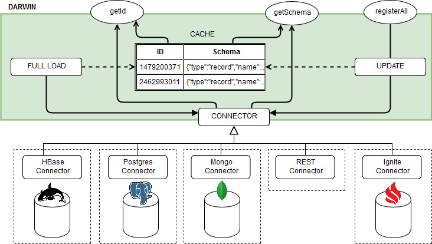
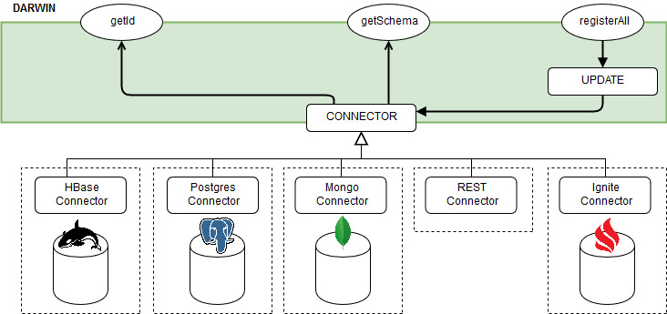

# Darwin

[](https://travis-ci.org/agile-lab-dev/darwin)


Table of contents
-------------

- General
  - [Overview](#overview)
  - [Artifacts](#artifacts)
  - [Background](#background)
  - [Architecture](#architecture)
  - [JVM compatibility](#jvm-compatibility)
- [Installation](#installation)
- [Usage](#usage)
- [Configuration](#configuration)
  - [General](#general)
  - [HBase](#hbase)
  - [PostgreSql](#postgresql)
  - [REST](#rest)
---

Overview
-------------
Darwin is a repository of Avro schemas that maintains all the schema versions used during your application lifetime.
Its main goal is to provide an easy and transparent access to the Avro data in your storage independently from 
schemas evolutions.
Darwin is portable and it doesn't require any application server.
To store its data, you can choose from multiple storage managers (HBase, Postgres) easily pluggable importing the 
desired connector.

Artifacts
--------------
Darwin artifacts are published for scala 2.10, 2.11, 2.12 and 2.13 (from version 1.0.12). 
From version 1.0.2 Darwin is available from maven central so there is no need to configure additional repositories 
in your project.

In order to access to Darwin core functionalities add the core dependency to you project:

### core

#### sbt
```scala
libraryDependencies += "it.agilelab" %% "darwin-core" % "1.0.12"
``` 
#### maven
```xml
<dependency>
  <groupId>it.agilelab</groupId>
  <artifactId>darwin-core_2.11</artifactId>
  <version>1.0.12</version>
</dependency>
```

### HBase connector

Then add the connector of your choice, either HBase:

#### sbt
```scala
libraryDependencies += "it.agilelab" %% "darwin-hbase-connector" % "1.0.12"
``` 
#### maven
```xml
<dependency>
  <groupId>it.agilelab</groupId>
  <artifactId>darwin-hbase-connector_2.11</artifactId>
  <version>1.0.12</version>
</dependency>
```

### Postgresql connector

Or PostgreSql:

### sbt

```scala
libraryDependencies += "it.agilelab" %% "darwin-postgres-connector" % "1.0.12"
``` 
#### maven
```xml
<dependency>
  <groupId>it.agilelab</groupId>
  <artifactId>darwin-postgres-connector_2.11</artifactId>
  <version>1.0.12</version>
</dependency>
```


### Rest Connector

Or Rest

### sbt

```scala
libraryDependencies += "it.agilelab" %% "darwin-rest-connector" % "1.0.12"
``` 
#### maven
```xml
<dependency>
  <groupId>it.agilelab</groupId>
  <artifactId>darwin-rest-connector_2.11</artifactId>
  <version>1.0.12</version>
</dependency>
```

#### Rest server

To use the rest connector implement the required endpoints or use the reference implementation provided by rest-server module

### Mock connector

Or Mock (only for test scenarios):

### sbt

```scala
libraryDependencies += "it.agilelab" %% "darwin-mock-connector" % "1.0.12"
``` 
#### maven
```xml
<dependency>
  <groupId>it.agilelab</groupId>
  <artifactId>darwin-mock-connector_2.11</artifactId>
  <version>1.0.12</version>
</dependency>
```

Background
-------------
In systems where objects encoded using Avro are stored, a problem arises when there is an evolution of the structure 
of those objects. In these cases, Avro is not capable of reading the old data using the schema extracted from the 
actual version of the object: in this scenario each avro-encoded object must be stored along with its schema. 
To address this problem Avro defined the [Single-Object Encoding specification](https://avro.apache.org/docs/1.8.2/spec.html#single_object_encoding_spec):
>### Single-object encoding
>In some situations a single Avro serialized object is to be stored for a longer period of time.
>In the period after a schema change this persistance system will contain records that have been written with 
different schemas. So the need arises to know which schema was used to write a record to support schema evolution correctly.
In most cases the schema itself is too large to include in the message, so this binary wrapper format supports the use case more effectively.

Darwin is compliant to this specification and provides utility methods that can generate a Single-Object encoded from
 an Avro byte array and extract an Avro byte array (along with its schema) from a Single-Object encoded one.

Architecture
-------------
### Darwin architecture schema
Darwin maintains a repository of all the known schemas in the configured storage, and can access these data in three 
configurable ways:
1. ##### Eager Cached
    Darwin loads all schemas once from the selected storage and fills with them an internal cache that is used for 
    all the subsequent queries. The only other access to the storage is due to the invocation of the `registerAll` 
    method which updates both the cache and the storage with the new schemas. Once the cache is loaded, all the 
    `getId` and `getSchema` method invocations will perform lookups only in the cache.

    

2. ##### Lazy Cached
    Darwin behaves like the Eager Cached scenario, but each cache miss is then attempted also into the storage. If 
    the data is found on the storage, the cache is then updated with the fetched data.
    
    
    
3. ##### Lazy
    Darwin performs all lookups directly on the storage: there is no applicative cache.
    
    

### Darwin interaction
Darwin can be used to easily read and write data encoded in Avro Single-Object using the 
`generateAvroSingleObjectEncoded` and `retrieveSchemaAndAvroPayload` methods of a `AvroSchemaManager` instance (they 
rely on the `getId` and `getSchema` methods discussed before). These methods allow your application to convert and 
encoded avro byte array into a single-object encoded one, and to extract the schema and payload from a single-object 
encoded record that was written.
If there is the need to use single-object encoding utilities without creating an `AvroSchemaManager` instance, the 
utilities object `AvroSingleObjectEncodingUtils` exposes some generic purpose functionality, such as:
- check if a byte array is single-object encoded
- create a single-object encoded byte array from payload and schema ID
- extract the schema ID from a single-object encoded byte array
- remove the header (schema ID included) of a single-object encoded byte array


JVM compatibility
-------------
Darwin is cross-published among different scala versions (2.10, 2.11, 2.12, 2.13).
Depending on the Scala version, it targets different JVM versions.

Please refer to the following compatibility matrix:

| Scala version | JVM version |
|---------------|-------------|
| 2.10 | 1.7 |
| 2.11 | 1.7 |
| 2.12 | 1.8 |
| 2.13 | 1.8 |

Installation
-------------
To use Darwin in your application, simply add it as dependency along with one of the available connectors.
Darwin can automatically load the defined connector, and it can be used directly to register and to retrieve 
Avro schemas.

Usage
-------------
Darwin main functionality are exposed by the `AvroSchemaManager`, which can be used to store and retrieve the known 
avro schemas.
To get an instance of `AvroSchemaManager` there are two main ways:
1. You can create an instance of `AvroSchemaManager` directly, passing a `Connector` as constructor argument; the 
available implementations of `AvroSchemaManager` are the ones introduced in te chapter [Architecture](#architecture):
 `CachedEagerAvroSchemaManager`, `CachedLazyAvroSchemaManager` and `LazyAvroSchemaManager`.
2. You can obtain an instance of `AvroSchemaManager` using the `AvroSchemaManagerFactory`: for each configuration 
passed as input of the `initialize` method, a new instance is created. The instance can be retrieved later using the 
`getInstance` method.

To get more insight on how the Typesafe configuration must be defined to create an `AvroSchemaManager` instance (or 
directly a `Connector` instance), please check how the configuration file should be created in the Configuration 
section of the storage you chose.

Once you created an instance of `AvroSchemaManager`, first of all an application should register all its known Avro
 schemas invoking the `registerAll` method:
```
  val manager: AvroSchemaManager = AvroSchemaManagerFactory.initialize(config)
  val schemas: Seq[Schema] = //obtain all the schemas
  val registered: Seq[(Long, Schema)] = manager.registerAll(schemas)
```
To generate the Avro schema for your classes there are various ways, if you are using standard Java pojos:
```
  val schema: Schema = ReflectData.get().getSchema(classOf[MyClass])
```
If your application uses the _avro4s library_ you can instead obtain the schemas through the `AvroSchema` typeclass 
implicitly generated by _avro4s_, e.g.:
```
  val schema: Schema = new AvroSchema[MyClass]
```
Once you have registered all the schemas used by your application, you can use them directly invoking the 
`AvroSchemaManager` object: it exposes functionality to retrieve the schema from an ID and vice-versa.
```
  val id: Long = manager.getId(schema)
  val schema: Schema = manager.getSchema(id)
```

As said previously, in addition to the basic methods, the `AvroSchemaManager` object exposes also some utility methods 
that can be used to encode/decode a byte array in single-object encoding:
```
  def generateAvroSingleObjectEncoded(avroPayload: Array[Byte], schema: Schema): Array[Byte]

  def retrieveSchemaAndAvroPayload(avroSingleObjectEncoded: Array[Byte]): (Schema, Array[Byte])
```

If new schemas are added to the storage and the application must reload all the data from it (in order to manage also
 objects encoded with the new schemas), the `reload` method can be used:
 ```
 manager.reload()
 ```
 Please note that this method can be used to reload all the schemas in cached scenarios (this method does nothing if 
 you are using a `LazyAvroSchemaManager` instance, because all the find are performed directly on the storage).

Configuration
-------------

## General

The general configuration keys are:
- **endianness**: tells the factory the endianness which will be used to store and parse schema fingerprints.
Allowed values are: "LITTLE_ENDIAN" and "BIG_ENDIAN".
- **type**: tells the factory which instance of `AvroSchemaManager` must be created. Allowed values are: 
"cached_eager", "cached_lazy" and "lazy".
- **connector** (optional): used to choose the connector if there are multiple instances of connectors found at 
runtime. If multiple instances are found and this key is not configured, the first connector is taken. All available 
connectors names are suitable for this value (e.g. "hbase", "postgresql", etc)
- **createTable** (optional): if true, tells the chosen Connector to create the repository table if not already 
present in the storage.

## HBase

The configuration keys managed by the `HBaseConnector` are:
- **namespace** (optional): namespace of the table used by Darwin to store the schema repository (if it isn't set, 
the default value "AVRO" is used)
- **table** (optional): name of the table used by Darwin to store the schema repository (if it isn't set, the default
 value "SCHEMA_REPOSITORY" is used)
- **coreSite** (optional): path of the core-site.xml file (not mandatory if the file is already included in the 
classpath)
- **hbaseSite** (optional): path of the hbase-site.xml file (not mandatory if the file is already included in the 
classpath)
- **isSecure**: true if the HBase database is kerberos-secured
- **keytabPath** (optional): path to the keytab containing the key for the principal
- **principal** (optional): name of the principal, usually in the form of `primary/node@REALM`

Example of configuration for the `HBaseConnector`:
```
"isSecure": false,
"namespace": "DARWIN",
"table": "REPOSITORY",
"coreSite": "/etc/hadoop/conf/core-site.xml",
"hbaseSite": "/etc/hadoop/conf/hbase-site.xml",
```
### HBase Connector dependencies
Darwin HBase Connector does not provide HBase dependencies in a transitive manner since that would lead to hard to 
manage classpath and class versions conflicts (see Maven hell). Therefore it is mandatory to include also HBase 
dependencies into your project. 

## Postgresql

The configuration keys managed by the `PostgresConnector` are:
- **table** (optional): name of the table used by Darwin to store the schema repository (if it isn't set, the default
 value "SCHEMA_REPOSITORY" is used)
- **host**: the host of the PostgreSql database
- **db**: the name of the database where the table will be looked for
- **username**: the user to connect to PostgreSql
- **password**: the password of the user to connect to PostgreSql

Example of configuration for the `PostgresConnector`:
```
"host": "localhost:5432"
"db": "srdb"
"username": "postgres"
"password": "srpsql"
"table": "schema_registry"
```

## REST

The configuration keys managed by the `RestConnector` are:
- 
- **protocol**: http or https
- **host**: the hostname where rest-server (or an http proxy) is deployed
- **port**: the port where rest-server (or an http proxy) is listening
- **basePath**: the path that should be prefixed to all requests (useful if rest-server is running behind a reverse proxy)

Example of configuration for the `RestConnector`:
```
"protocol": "http"
"host": "localhost"
"port": 8080
"basePath": "/"
```

### REST Server

A rest server is provided by module rest-server (only for scala 2.11, 2.12 and 2.13), just run main class

`it.agilelab.darwin.server.rest.Main`

### REST Server configuration

The same configuration options of darwin as a library should be configured under the darwin key.

The rest server also accepts a rest specific configuration under darwin-rest key.

Example configuration for the `RestServer`:

```
darwin {
  type = "lazy"
  connector = "mock"
}

darwin-rest {
  interface = "localhost"
  port = 8080
}
```

## Mock

MockConnector can be conveniently used during tests or if all the schemas (past and current) are known when launching 
the application.
The MockConnector can load schemas from local files and classpath resources, it can run in two modes: strict and permissive.
Strict mode fails if any schema cannot be read, while Permissive one will just warn on non-readable schemas. 
Default mode is "strict".

Here is an example of configuration:

```json
"files": ["/home/user/schema1.avsc", "/home/user/schema2.avsc"]
"resources": ["schemas/Apple.avsc", "schemas/Orange.avsc"]
"mode": "permissive"
```